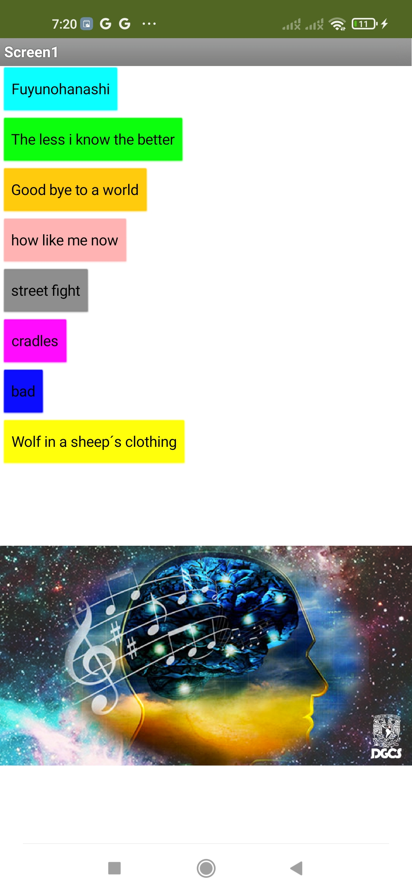
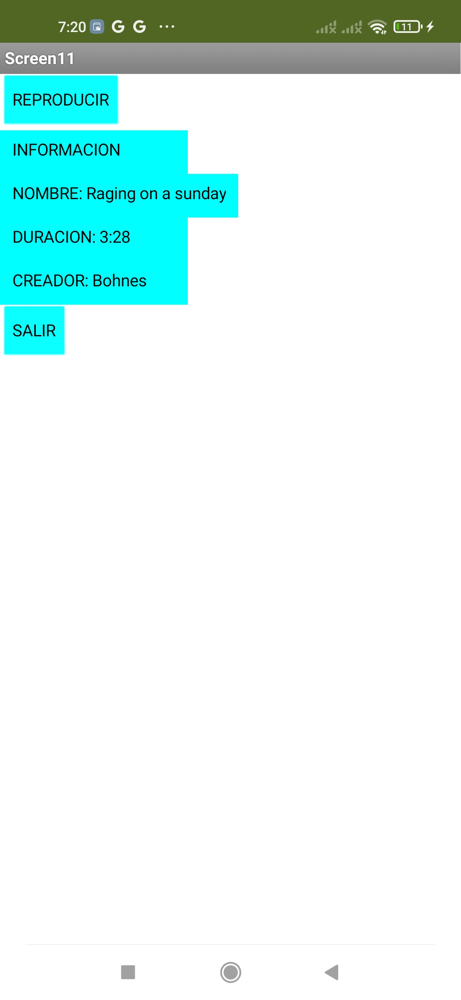

# 🎵 Music Player App – MIT App Inventor Project

This is a mobile **music player app** developed using **MIT App Inventor**. The app features a menu screen with **14 different songs**, each represented by a button. When a user taps a song button, they are taken to a dedicated **info screen** showing:
- Song name  
- Artist  
- Duration  
- Two buttons: one to **play** the song, and one to **return** to the main menu

This project helped me explore multi-screen design, media components, and interactive layouts in mobile development.

---

## 💡 Features
- 🎶 14 unique songs, each with its own dedicated screen
- 📋 Each song screen includes title, artist name, and duration
- ▶️ Button to **play** the song
- 🔙 Button to return to the **main screen**
- 📱 Simple and clean UI built with MIT App Inventor blocks

---

## 🛠️ Built With
- [MIT App Inventor](https://appinventor.mit.edu/)
- MIT AI2 Companion (for testing)
- Android smartphone with media support

---

## 🚀 How to Use

1. Open [MIT App Inventor](https://ai2.appinventor.mit.edu/)
2. Import the `music_player.aia` file via **Projects > Import project**
3. Test the app using the **MIT AI2 Companion** or build an `.apk` file and install it
4. On the main screen, select a song to view more info and listen to it

---

## 📸 Screenshots

**Main Song Selection Screen**  

**Example Song Info Screen**  

---

## 🧠 What I Learned
- Managing **multiple screens** and component visibility in App Inventor
- Using the **Audio Player** component to handle music playback
- Creating **organized UI layouts** for clean user navigation
- Handling **media files and transitions** between app states

---

## 📫 Contact
- 📧 iandanielalfon@gmail.com  
- 🔗 [LinkedIn – Ian Alfonso](https://www.linkedin.com/in/ianalfonso)

---

🙌 Thanks for checking out my **Music Player App**! Feel free to try it out, remix it, or leave suggestions.
